# Architecture Overview

Grim is a pure-Rust inference engine designed for running autoregressive language models, SSM-based architectures, diffusion models, and vision/audio encoders on CPU and GPU backends.

## Workspace Structure

The workspace contains 28 crates organized into logical layers:

- **Core layer** (`grim-tensor`, `grim-quant`, `grim-format`): Foundation types for tensors, data types, quantization, and model formats
- **Backend layer** (`grim-backend-cpu`, `grim-backend-rocm`, `grim-backend-cuda`, `grim-backend-vulkan`, `grim-backend-metal`): Hardware-specific implementations
- **Model layer** (`grim-nn`, `grim-models-*`): Neural network modules and pre-built model architectures
- **Runtime layer** (`grim-core`, `grim-engine`, `grim-scheduler`, `grim-memory`, `grim-kvquant`, `grim-kvtransport`, `grim-autograd`, `grim-speculative`): Inference orchestration, memory management, and speculative decoding
- **Service layer** (`grim-server`, `grim-cli`, `grim-plugin`, `grim-disagg`, `grim-garage`): API serving, CLI, plugins, and training dashboard

## Workspace Dependency Graph

```mermaid
graph TD
    %% Core foundation
    A[grim-tensor] -->|DType, Shape, Device| B[grim-quant]
    A -->|Tensor, Backend traits| C[grim-format]
    
    %% Backend dependencies
    A -->|BackendDevice trait| D[grim-backend-cpu]
    A -->|BackendDevice trait| E[grim-backend-rocm]
    A -->|BackendDevice trait| F[grim-backend-cuda]
    A -->|BackendDevice trait| G[grim-backend-vulkan]
    A -->|BackendDevice trait| H[grim-backend-metal]
    
    C -->|GGUF I/O| B
    B -->|Quantization| D
    B -->|Quantization| E
    B -->|Quantization| F
    B -->|Quantization| G
    B -->|Quantization| H
    
    %% Neural network modules
    A -->|Tensor types| I[grim-nn]
    D -->|Reference impl| I
    E -->|GPU kernels| I
    I -->|WeightSource| J[grim-models-transformer]
    I -->|WeightSource| K[grim-models-mamba]
    I -->|WeightSource| L[grim-models-vision]
    I -->|WeightSource| M[grim-models-audio]
    I -->|WeightSource| N[grim-models-diffusion]
    
    %% Core orchestration
    A -->|Tensor types| O[grim-core]
    I -->|Modules| O
    C -->|Model loading| O
    D -->|CPU backend| O
    
    %% Memory and scheduling
    A -->|Tensor types| P[grim-memory]
    O -->|KvCache trait| P
    A -->|Tensor types| Q[grim-kvquant]
    O -->|KvCache trait| Q
    A -->|Tensor types| R[grim-kvtransport]
    O -->|KvCache trait| R
    
    %% Speculative decoding
    A -->|Tensor types| S[grim-speculative]
    O -->|Sampler| S
    J -->|CausalLm| S
    
    %% Autograd
    A -->|Tensor types| T[grim-autograd]
    C -->|WeightSource| T
    D -->|CPU backend| T
    
    %% Engine
    A -->|Tensor types| U[grim-engine]
    O -->|Model traits| U
    I -->|Modules| U
    D -->|CPU backend| U
    E -->|GPU kernels| U
    P -->|Memory| U
    S -->|Speculative| U
    T -->|Autograd| U
    
    %% Scheduler
    O -->|Session, Sampler| V[grim-scheduler]
    R -->|KV transport| V
    
    %% Plugin system
    A -->|Tensor types| W[grim-plugin]
    O -->|Paths| W
    
    %% Server
    A -->|Tensor types| X[grim-server]
    U -->|Engine| X
    V -->|Scheduler| X
    E -->|ROCm| X
    F -->|CUDA| X
    H -->|Metal| X
    D -->|CPU| X
    O -->|Model traits| X
    C -->|Format| X
    
    %% CLI
    U -->|Engine| Y[grim-cli]
    X -->|Server| Y
    W -->|Plugin| Y
    S -->|Speculative| Y
    AB -->|Graph| Y

    %% Disaggregation
    O -->|Session| Z[grim-disagg]
    R -->|Transport| Z

    %% Garage
    U -->|Engine| AA[grim-garage]
    T -->|Autograd| AA
    
    %% Graph
    A -->|Tensor types| AB[grim-tensor-graph]
    C -->|Format| AB
    
    %% Training
    U -->|Engine| AC[grim-speculative]
    
    style A fill:#e1f5e1
    style O fill:#fff3e0
    style I fill:#f3e5f5
    style U fill:#e8f5e8
```



## Key Types and Traits

### Data Flow

1. **Model Loading** (`grim-format`): Reads GGUF/safetensors files, loads tensors via `TensorProvider` trait
2. **Weight Application** (`grim-nn`): Applies weights through `VarBuilder`-like interface
3. **Inference** (`grim-engine`): Orchestrates forward pass through `Engine` struct
4. **Request Serving** (`grim-server`): HTTP/OpenAI-compatible endpoints via `axum`

### Core Traits

- **`BackendDevice`** (`grim-tensor`): Hardware-agnostic tensor operations (matmul, attention, etc.)
- **`BackendStorage`** (`grim-tensor`): Device-specific tensor storage
- **`ComputeHandle`** (`grim-tensor`): Async operation tracking
- **`KvCache`** (`grim-core`): Key-value cache interface for autoregressive generation
- **`Session`** (`grim-core`): Per-request state and RNG for deterministic inference
- **`Model`** (`grim-core`): Model trait family for different architectures

## Backend Architecture

### Device Abstraction

The `Device` enum supports multiple backends:

```rust
pub enum Device {
    Cpu,                    // Always available reference
    Rocm(usize),           // ROCm/HIP primary target
    Vulkan,                // Platform-agnostic fallback
    Cuda(usize),           // NVIDIA CUDA
    Metal(usize),          // Apple Metal
}
```

### Backend Features

- **`grim-backend-cpu`**: SIMD-optimized with OxiBLAS, scalar fallback
- **`grim-backend-rocm`**: rocBLAS, hip graph capture, fused kernels, cubecl integration
- **`grim-backend-cuda`**: cuBLAS GEMM operations
- **`grim-backend-vulkan`**: Simulated JIT/autotuning
- **`grim-backend-metal`**: Metal compute shaders on Apple Silicon

## Error Handling Conventions

The workspace uses `thiserror` for error definitions with consistent categorization:

- `grim-tensor::Error`: Tensor operation failures (shape, dtype, device)
- `grim-core::Error`: Core orchestration failures (config, session, kv cache)
- `anyhow::Error`: Used sparingly for application-level errors

Error propagation follows the `Result<T, Error>` pattern throughout, with `thiserror` derive macros generating `Display` implementations.

## Non-obvious Design Decisions

1. **Speculative decoding is default-on**: The `Engine` wraps all causal models in `SpeculativeCausalLm` automatically
2. **Continuous-batching scheduler**: Three-queue design (waiting/running/swapped) for latency-aware admission control
3. **Paged KV cache**: Uses block allocator with prefix caching for efficient memory management
4. **Autograd scope**: Only traces backward for adapter weights (LoRA/QLoRA), not full model parameters
5. **Tiered KV transport**: GPU → Host RAM → NVMe spill for large context windows
6. **Self-tuning parameters**: Engine adapts batch size, speculative depth, and KV compression at runtime

## Out of Scope

- Full fine-tuning (only LoRA/QLoRA adapter training)
- Multimodal embeddings (not implemented)
- Audio transcription (not implemented)
- Image generation (not implemented)
- gRPC serving is not implemented (the `/grpc` route returns a stub)
- Non-ROCm GPU backends are optional and may fall back to CPU