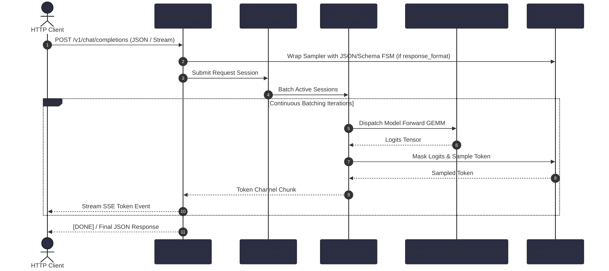

# External Integrations

This document describes all external protocols, client APIs, hardware driver libraries, and plugin environments integrated with Grim.

---

## 1. HTTP API Serving (`grim-server`)

`grim-server` runs an asynchronous Axum HTTP service implementing both OpenAI-compatible and Ollama-compatible API standards.

### Supported Endpoints

- **OpenAI Compatible**:
  - `POST /v1/chat/completions` (Streaming SSE & JSON responses, supports `response_format` via `grim-constrain`)
  - `POST /v1/completions`
  - `GET /v1/models`
- **Ollama Compatible**:
  - `POST /api/generate`
  - `POST /api/chat`
  - `GET /api/tags`
  - `POST /api/show`
  - `POST /api/pull`
- **Observability**:
  - `GET /health`
  - `GET /metrics` (Prometheus exporter)

### Request Lifecycle Diagram

---

## 2. Remote Model Registries (`grim-cli`)

`grim pull` communicates with remote model repositories:

- **Hugging Face Hub**: Downloads `.gguf` and `.safetensors` weight splits over HTTPS using `reqwest`.
- **Ollama Registry**: Pulls manifest descriptors and layer blobs over HTTPS.

---

## 3. Plugin Runtime (`grim-plugin`)

`grim-plugin` enables extending the engine using:
1. **Dynamic Libraries (`.so` / `.dylib` / `.dll`)**: Loaded via `libloading` for native C-ABI plugins.
2. **WebAssembly (`.wasm`)**: Executed inside a sandboxed WASM runtime (`wasmtime`) with isolated memory boundaries.

---

## 4. Hardware Driver Integrations

- **ROCm**: Dynamic loading of `libamdhip64.so` and `librocblas.so`.
- **CUDA**: FFI bindings to `libcudart.so` and `libcublas.so`, plus `nvcc` child process invocation for PTX JIT compilation.
- **Vulkan**: Dynamic linking to Vulkan loader (`libvulkan.so.1`) for SPIR-V compute dispatch.
- **Metal**: macOS Metal framework and Metal Performance Shaders (MPS) bindings.

---

## 5. Multimodal Capabilities

Grim includes models and routing surfaces for multimodal workloads:

- **Vision**: `grim multimodal vision encode --image <path> --model <name>` (routes to `grim-models-vision`).
- **Audio (ASR / TTS)**: `POST /v1/audio/transcriptions` and `grim multimodal audio transcribe` (routes to `grim-models-audio` / `wav_tokenizer_dec`).
- **Diffusion (Image Generation)**: `POST /v1/images/generations` and `grim multimodal diffusion generate` (routes to `grim-models-diffusion` / `diffusion_gemma`).

---

## 6. Tool Calling & Function Execution

Grim server parses structured tool definitions in `POST /v1/chat/completions` requests and extracts function arguments. See [`docs/howto/tool-calling.md`](howto/tool-calling.md) for a copy-paste runnable curl example.

---

## 7. Model Trust & Provenance

To verify model artifacts against tampering and review hardware configuration:
- Use `grim provenance <path>` to print SHA256 checksums, tensor formats, quantization info, and catalog registration status.
- Use `grim doctor --model <path>` to execute header-only pre-flight checks and verify memory fit before loading.

---

## 8. Health & Metrics

- **Health Probe**: `GET /health` (returns `{"status": "ok"}`).
- **Prometheus Metrics**: `GET /metrics` (active sessions, KV cache memory tiers, scheduler queues, tokens/sec). Public access enabled via `GRIM_ALLOW_PUBLIC_METRICS=1`. See [`docs/howto/deploy.md`](howto/deploy.md).

