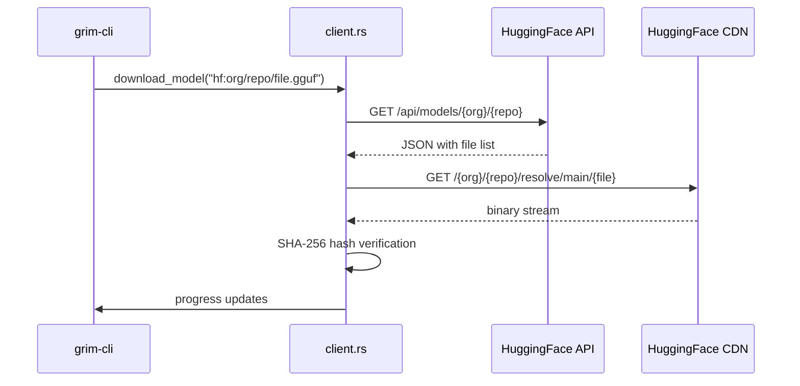
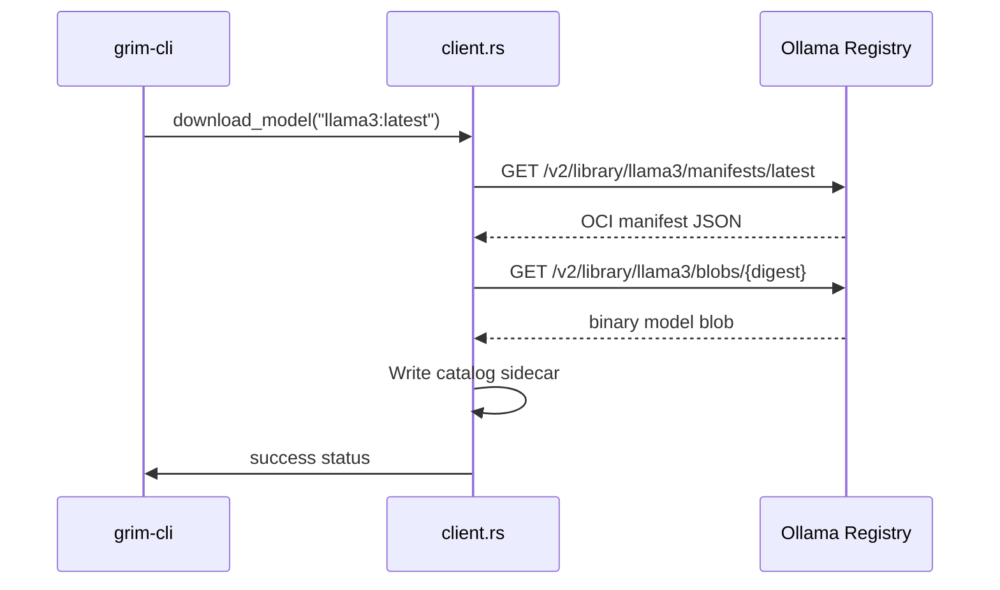
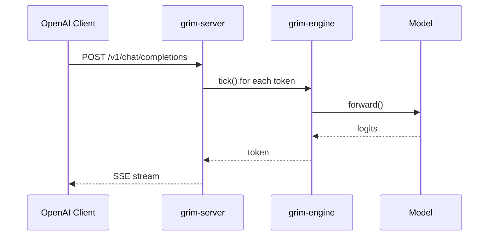

# Integrations Reference

This document describes all external systems integrated by Grim.

## Hugging Face Hub

Grim integrates with Hugging Face Hub for model discovery and download.

### Crate Ownership

- `grim-core::client` (download functions)
- `grim-core::catalog` (model resolution)

### Configuration

No configuration required beyond network access. The integration uses:
- User-Agent identification for rate limiting
- SSL verification (standard TLS)

### Sequence Diagram

### Protocol Compatibility

- HTTP/1.1 with TLS 1.2+
- Standard HuggingFace file resolution URLs
- No API key required for public models

### Failure Modes

| Condition | Source | Handling |
|---|---|---|
| 404 Not Found | HF API response | Returns error with hint to check model name |
| Authentication required | HF API response | Returns 401 with error message |
| Network timeout | reqwest client | Retries with different error message |
| Invalid URL | `validate_public_url()` | Returns 400 Bad Request error |
| SSRF blocked | `is_public_ip()` check | Returns error before request |

## Ollama Registry

Grim integrates with the Ollama model registry for model discovery.

### Crate Ownership

- `grim-core::client` (`download_grim_registry`)

### Configuration

Uses environment variable `GRIM_REGISTRY` = `https://registry.ollama.ai`

### Sequence Diagram

### Protocol Compatibility

- OCI/Docker registry compatible API
- HTTP/1.1
- Standard manifest and blob endpoints

### Failure Modes

| Condition | Source | Handling |
|---|---|---|
| Model not found | Registry response | Returns 404 with model name |
| Invalid tag | Manifest fetch fails | Returns error with available tags |
| Rate limited | Registry response | Returns 429 error |

## OpenAI HTTP API

Grim's server implements an OpenAI-compatible API for integration with existing tools.

### Crate Ownership

- `grim-server` (HTTP handlers)

### Configuration

No configuration required. Endpoints available at `http://127.0.0.1:11434/v1/`

### Supported Endpoints

| Endpoint | Method | Description |
|---|---|---|
| `/v1/chat/completions` | POST | Chat completions with streaming |
| `/v1/completions` | POST | Text completions |
| `/v1/models` | GET | Model catalog |
| `/v1/models/{id}/load` | POST | Dynamic model loading |
| `/v1/models/{id}` | DELETE | Unload model |
| `/v1/status` | GET | Server status |
| `/v1/metrics` | GET | Prometheus metrics |

### Sequence Diagram

### Protocol Compatibility

- OpenAI Chat Completion API v1
- Server-Sent Events for streaming
- JSON request/response format

### Failure Modes

| Condition | Source | Handling |
|---|---|---|
| Unknown field | Request validation | Returns 400 Bad Request |
| Unknown adapter | Adapter lookup | Returns 400 with adapter name |
| Determinism mismatch | Mode check | Returns 400 with details |
| Model not found | Dynamic load | Returns 404 with download hint |
| Out of memory | Backend | Returns 500 with error |

## GGUF Format

Grim supports GGUF (GPT-Generated Unified Format) for model checkpoints.

### Crate Ownership

- `grim-format` (`GgufProvider`, `GgufTokenizer`)

### Format Version

- GGUF v1+ (compatible with llama.cpp 0.2.0+)

### Supported Features

| Feature | Description |
|---|---|
| Tensor data | F32, F16, BF16, quantized |
| Tokenization | Jinja templates, GPT-2, Llama |
| Metadata | Model name, architecture, quantization |

### Failure Modes

| Condition | Handling |
|---|---|
| Corrupted file | Returns error on parse |
| Unsupported quantization | Returns Unimplemented error |
| Missing tokenizer | Falls back to raw token IDs |

## Safetensors Format

Grim supports safetensors for PyTorch checkpoint compatibility.

### Crate Ownership

- `grim-format` (`safetensors` module)

### Supported Features

| Feature | Description |
|---|---|
| Tensor data | F32, F16, and quantized variants |
| Metadata | Via key-value pairs |

## Filesystem Paths

Grim uses standardized paths for data directories.

### Path Resolution Order

1. **Environment variable override** (`GRIM_MODELS_DIR`, etc.)
2. **System directory** (`/var/lib/grim/models`, `/etc/grim`)
3. **User directory** (`~/.grim/models`, `~/.grim`)

### Default Paths

| Directory | Default Location | Contents |
|---|---|---|
| Models | `$GRIM_MODELS_DIR` | `.gguf`, `.grim`, `.safetensors` |
| Config | `$GRIM_CONFIG_DIR` | `grim.toml`, service files |
| Logs | `$GRIM_LOG_DIR` | Server logs |
| Plugins | `$GRIM_PLUGINS_DIR` | `.grimplugin` files |

## GPU Backend Protocols

### ROCm/HIP

Protocol: `hipblas`, `hipfft`, `hipMath`
Requires: ROCm runtime (7.0+)

### CUDA

Protocol: cuBLAS, cuDNN
Requires: CUDA toolkit (11.8+)

### Vulkan

Protocol: VK_KHR_compute, VK_KHR_shader_clock
Requires: Vulkan 1.1+ driver

### Metal

Protocol: MSL compute shaders
Requires: macOS with Metal framework