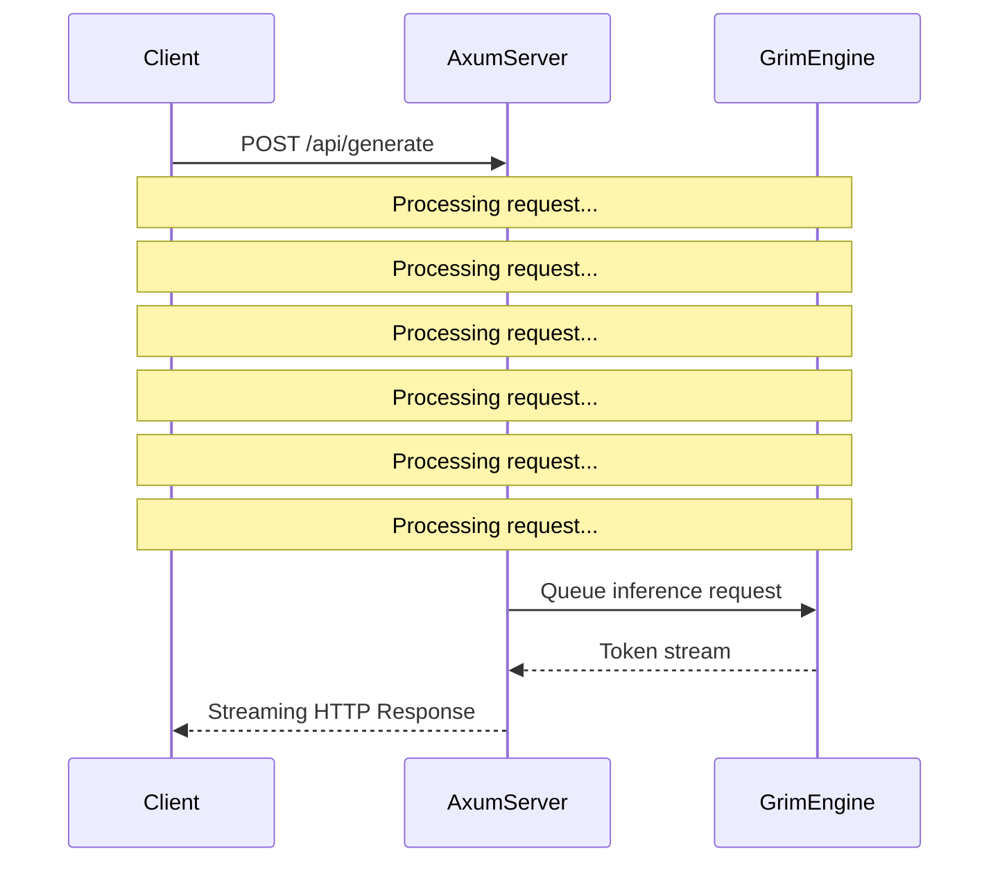

# Integrations

## Hardware Backends

The engine routes tensor operations to available hardware backends:

*   **ROCm/HIP**: Supported via `grim-backend-hip` crate for AMD accelerators.
*   **CUDA**: Supported via `grim-backend-cuda` crate for NVIDIA accelerators.
*   **Vulkan**: Hardware-agnostic GPU acceleration using `grim-backend-vulkan`.
*   **Metal**: Apple Silicon GPU support via `grim-backend-metal`.

## Network and API

### Axum REST & Ollama Protocol
The HTTP serving layer is implemented using `axum`. The server implements the Ollama API specification to expose inference endpoints.

### WASM Runtime
The framework supports a WebAssembly target for browser-based client execution. Memory structures are mapped to `WebAssembly.Memory`.

## Failure Modes
*   **OOM (Out of Memory)**: If hardware backends exceed VRAM bounds, the process will panic unless intermediate offloading is configured.
*   **Backend Mismatch**: If `grim-backend-cuda` is queried on a host without NVIDIA drivers, execution falls back to CPU or aborts based on configuration.