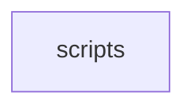

# scripts

Repository automation, benchmark harnesses, regression gates, and testing utilities for Grim.

[Back to project README](../README.md)

## Dependencies

No internal dependencies.

External dependencies: Python 3, Bash, standard POSIX utilities.

## Flamegraph

Not applicable - source scripts folder (no compiled binary).

## Source Layout

| Folder | Purpose |
|---|---|
| `check-norm-gate.sh` | RMS normalization and fused layer-norm numerical precision gate |
| `check-citycrow-gate.sh` | CityCrow and IQ-family quantization accuracy regression gate |
| `check-gate-restore.sh` | Pre-merge gating suite validating kernel compilations and parity tests |
| `check-hip-guards.sh` | Static audit ensuring ROCm HIP GPU calls respect thread and device boundary guards |
| `check_eval_regression.py` | Evaluation metric tracker detecting perplexity or loss drift |
| `parity-vs-ollama.sh` | End-to-end token output and throughput comparison against Ollama reference servers |
| `gguf-tensor-dump.py` | Dependency-free GGUF metadata and tensor-table dump; pass `--tensors` for every tensor |
| `qwen3vl_geometry.py` | Multimodal (`clip` / `mmproj`) geometry gate: cross-checks a checkpoint's declared tensor shapes against its own metadata |
