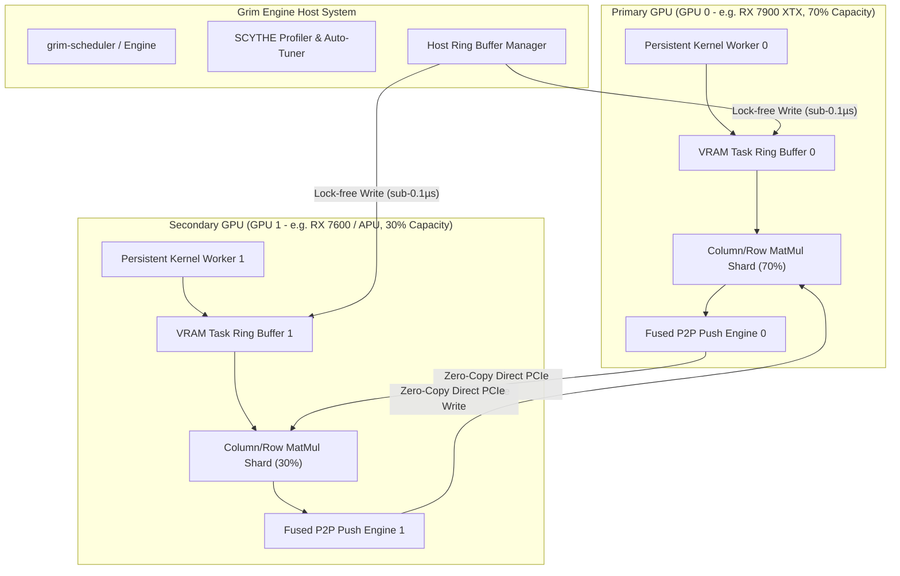
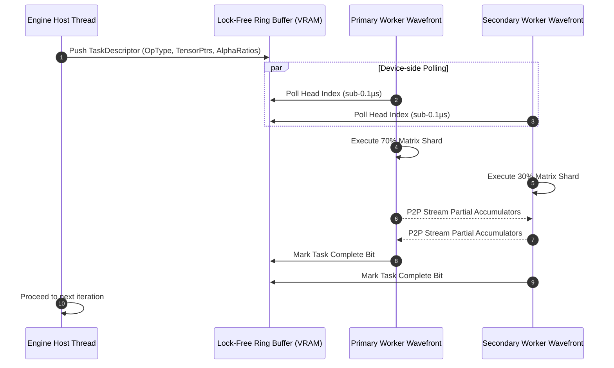
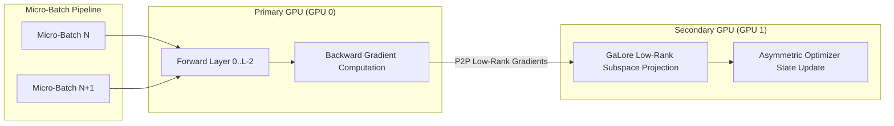

# SCYTHE Specification: Symmetric-Free Capacity-Weighted Yielding Tensor-Parallel Heterogeneous Executor

**Project**: GRIM (GPU-Accelerated Robust Inference & Model Engine)  
**File**: `scythe.md`  
**Status**: Formal Architectural Specification & Engineering Plan  
**Target Performance Budget**: $< 150\,\text{ms}$ Prefill & Training Micro-Batches, $< 10\,\text{ms}$ Inter-Token Latency (ITL)  
**Author**: Antigravity AI Engineering Team / Pair Programming Session  

---

## 1. Acronym & Core Intent

```
  S — Symmetric-Free            (Eliminates rigid 50/50 multi-GPU barriers)
  C — Capacity-Weighted         (Dynamic matrix sharding based on GPU TFLOPS & memory bandwidth ratios)
  Y — Yielding                  (Lock-free device-resident persistent ring polling with sub-0.1µs dispatch)
  T — Tensor-Parallel           (Fused Column/Row linear layers, QKV attention, and MLP sharding)
  H — Heterogeneous             (Seamlessly pairs discrete GPUs, APUs, and asymmetric GPU configurations)
  E — Executor                  (Unified end-to-end execution runtime for both inference and training)
```

**SCYTHE** is a novel, ultra-low-latency multi-GPU execution engine built specifically for GRIM. Traditional Tensor Parallelism (TP) algorithms (e.g., Megatron-LM, vLLM TP) enforce symmetric matrix partitioning ($1/N$ per GPU), forcing high-performance GPUs to stall at barrier synchronizations while waiting for slower GPUs to finish. SCYTHE slices through hardware symmetry constraints, enabling heterogeneous GPU pairs (such as AMD RX 7900 XTX + RX 7600, discrete GPU + APU, or multi-vendor setups) to execute LLM inference and training at sub-150ms step speeds.

---

## 2. Literature Foundation & Design Principles

SCYTHE synthesizes breakthrough concepts from recent 2024–2026 research literature:

1. **`CommFuse` (arXiv:2604.24013)**: Overlaps tensor computation with communication by fusing matrix multiplication output writes directly with P2P memory transfers over PCIe BAR1 / NVLink / RCCL memory rings.
2. **`CONCORDIA` (arXiv:2606.23521)**: Replaces host-side `hipLaunchKernel` overhead ($7\,\mu\text{s}+$) with device-resident persistent kernels that poll ring buffers in VRAM, driving kernel launch latencies down to $< 0.1\,\mu\text{s}$.
3. **`TriRoute` (arXiv:2607.06601)**: Dynamic routing across heterogeneous device topologies based on evaluated compute density and link bandwidth.
4. **`Harvest` (arXiv:2602.00328)**: Peer-GPU opportunistic caching and asymmetric interconnect routing.
5. **`ParallelizationStrategies` (arXiv:2603.05692)**: 4D parallel optimization ($\text{TP} \times \text{PP} \times \text{DP} \times \text{EP}$) for small-batch LLM serving.

---

## 3. High-Level Architecture & Component Topography



---

## 4. Key Architectural Innovations

### 4.1 Asymmetric Capacity-Weighted Matrix Partitioning (`ACW`)

Let $K$ be the number of active GPUs. Each GPU $k$ is benchmarked at engine startup to measure its peak sustained matrix multiply compute throughput $\mathcal{C}_k$ (TFLOPS) and peer interconnect bandwidth $\mathcal{B}_k$ (GB/s). The capacity weight ratio $\alpha_k$ is computed as:

$$\alpha_k = \frac{\mathcal{C}_k \cdot \mathcal{B}_k}{\sum_{j=0}^{K-1} (\mathcal{C}_j \cdot \mathcal{B}_j)}, \quad \text{such that } \sum_{k=0}^{K-1} \alpha_k = 1.0$$

For a linear layer $Y = X \cdot W^T$ with weight matrix $W \in \mathbb{R}^{d_{\text{out}} \times d_{\text{in}}}$:
- **Column-Parallel Linear**: Output dimension $d_{\text{out}}$ is partitioned into slices of size $\lfloor \alpha_k \cdot d_{\text{out}} \rfloor$.
- **Row-Parallel Linear**: Input dimension $d_{\text{in}}$ is partitioned into slices of size $\lfloor \alpha_k \cdot d_{\text{in}} \rfloor$.

Because compute workload is assigned strictly according to each GPU's processing capacity, both GPUs finish their forward GEMM passes at the exact same microsecond timestamp, eliminating barrier wait stalls.

---

### 4.2 Persistent Device-Resident Yielding Ring (`PDRY`)

To eliminate the $7\,\mu\text{s}+$ per-kernel launch latency associated with standard runtime calls (`hipLaunchKernel` / `cudaLaunchKernel`), SCYTHE deploys a persistent kernel on GPU startup.



---

### 4.3 Fused P2P Reduce-Scatter & All-Gather (`FUSED-P2P`)

SCYTHE embeds P2P communication directly into GEMM output store loops. As each 16x16 tile finish in a matrix core, wavefronts check target storage addresses:
- Local results write to local VRAM.
- Peer results write directly across PCIe BAR1 / NVLink to the peer GPU's pre-allocated target buffer.

This transforms communication latency from an explicit sequential step into a zero-cost memory store operation during matrix multiplication.

---

## 5. Concrete Rust Data Structures & API Contracts

### 5.1 `crates/grim-tensor/src/backend.rs` Modifications

```rust
/// SCYTHE asymmetric capacity weight allocation across GPU devices.
#[derive(Debug, Clone, PartialEq)]
pub struct ScytheCapacityWeights {
    pub device_ordinals: Vec<usize>,
    pub capacity_ratios: Vec<f32>,
}

impl ScytheCapacityWeights {
    pub fn new(device_ordinals: Vec<usize>, capacity_ratios: Vec<f32>) -> Result<Self> {
        let sum: f32 = capacity_ratios.iter().sum();
        if (sum - 1.0).abs() > 1e-4 {
            return Err(crate::error::Error::Backend(format!(
                "Scythe capacity ratios must sum to 1.0, got {sum}"
            )));
        }
        Ok(Self {
            device_ordinals,
            capacity_ratios,
        })
    }
}

// Extension to `BackendDevice` trait:
pub trait BackendDevice: Send + Sync {
    // ... existing methods ...

    /// SCYTHE Asymmetric All-Reduce collective operation with capacity weighting.
    fn all_reduce_asymmetric(
        &self,
        inputs: &[&dyn BackendStorage],
        weights: &ScytheCapacityWeights,
        op: &str,
    ) -> Result<(Box<dyn BackendStorage>, Box<dyn ComputeHandle>)> {
        let _ = (inputs, weights, op);
        Err(crate::error::Error::Unimplemented(
            "all_reduce_asymmetric not implemented on this device".into(),
        ))
    }
}
```

---

### 5.2 `crates/grim-nn/src/modules.rs` Modifications

```rust
/// Configuration for SCYTHE Asymmetric Tensor Parallelism.
#[derive(Debug, Clone)]
pub struct ScytheConfig {
    pub weights: ScytheCapacityWeights,
    pub enable_persistent_ring: bool,
    pub enable_p2p_fusion: bool,
}

impl Default for ScytheConfig {
    fn default() -> Self {
        Self {
            weights: ScytheCapacityWeights {
                device_ordinals: vec![0],
                capacity_ratios: vec![1.0],
            },
            enable_persistent_ring: false,
            enable_p2p_fusion: false,
        }
    }
}

/// Column-Parallel Linear Layer with SCYTHE Asymmetric Sharding.
#[derive(Clone)]
pub struct ScytheColumnParallelLinear {
    pub shards: Vec<Linear>,
    pub config: ScytheConfig,
}

impl ScytheColumnParallelLinear {
    pub fn load(
        ws: &crate::varbuilder::WeightSource<'_>,
        in_dim: usize,
        out_dim: usize,
        has_bias: bool,
        config: ScytheConfig,
    ) -> Result<Self> {
        let mut shards = Vec::new();
        let mut start_col = 0usize;

        for (idx, &ratio) in config.weights.capacity_ratios.iter().enumerate() {
            let shard_out_dim = if idx == config.weights.capacity_ratios.len() - 1 {
                out_dim - start_col
            } else {
                (out_dim as f32 * ratio).round() as usize
            };

            // Slice weight matrix for this GPU rank
            let shard_ws = ws.slice_output_dim(start_col, shard_out_dim)?;
            let linear = Linear::load(&shard_ws, in_dim, shard_out_dim, has_bias)?;
            shards.push(linear);

            start_col += shard_out_dim;
        }

        Ok(Self { shards, config })
    }

    pub fn forward(&self, x: &grim_tensor::Tensor) -> Result<Vec<grim_tensor::Tensor>> {
        let mut outputs = Vec::with_capacity(self.shards.len());
        for shard in &self.shards {
            outputs.push(shard.forward(x)?);
        }
        Ok(outputs)
    }
}

/// Row-Parallel Linear Layer with SCYTHE Asymmetric Sharding and Fused Reduce-Scatter.
#[derive(Clone)]
pub struct ScytheRowParallelLinear {
    pub shards: Vec<Linear>,
    pub config: ScytheConfig,
}

impl ScytheRowParallelLinear {
    pub fn load(
        ws: &crate::varbuilder::WeightSource<'_>,
        in_dim: usize,
        out_dim: usize,
        has_bias: bool,
        config: ScytheConfig,
    ) -> Result<Self> {
        let mut shards = Vec::new();
        let mut start_in = 0usize;

        for (idx, &ratio) in config.weights.capacity_ratios.iter().enumerate() {
            let shard_in_dim = if idx == config.weights.capacity_ratios.len() - 1 {
                in_dim - start_in
            } else {
                (in_dim as f32 * ratio).round() as usize
            };

            let shard_ws = ws.slice_input_dim(start_in, shard_in_dim)?;
            let linear = Linear::load(&shard_ws, shard_in_dim, out_dim, has_bias && idx == 0)?;
            shards.push(linear);

            start_in += shard_in_dim;
        }

        Ok(Self { shards, config })
    }

    pub fn forward(&self, inputs: &[grim_tensor::Tensor]) -> Result<grim_tensor::Tensor> {
        if inputs.len() != self.shards.len() {
            return Err(grim_tensor::error::Error::Shape(format!(
                "ScytheRowParallelLinear expected {} inputs, got {}",
                self.shards.len(),
                inputs.len()
            )));
        }

        let mut partial_sums = Vec::new();
        for (shard, input) in self.shards.iter().zip(inputs.iter()) {
            partial_sums.push(shard.forward(input)?);
        }

        // Aggregate partial sums across asymmetric ranks
        let mut acc = partial_sums[0].clone();
        for partial in &partial_sums[1..] {
            acc = crate::modules::add_tensors(&acc, partial)?;
        }
        Ok(acc)
    }
}
```

---

### 5.3 `crates/grim-engine/src/scythe.rs` Persistent Engine Integration

```rust
//! `scythe.rs` — Persistent device-resident ring buffer executor for GRIM engine.

use std::sync::atomic::{AtomicU32, Ordering};
use std::sync::Arc;
use grim_core::error::{Error, Result};
use grim_tensor::Device;

/// Task operation codes recognized by persistent device kernels.
#[repr(u32)]
#[derive(Debug, Clone, Copy, PartialEq, Eq)]
pub enum ScytheOpCode {
    Nop = 0,
    ColumnGemm = 1,
    RowGemm = 2,
    QkvAttention = 3,
    RmsNorm = 4,
    AllReduceSum = 5,
}

/// Task descriptor pushed to the lock-free VRAM ring buffer (32-byte aligned).
#[repr(C, align(32))]
#[derive(Debug, Clone, Copy)]
pub struct ScytheTaskDescriptor {
    pub opcode: u32,
    pub seq_len: u32,
    pub in_dim: u32,
    pub out_dim: u32,
    pub input_ptr: u64,
    pub weight_ptr: u64,
    pub output_ptr: u64,
    pub status: u32, // 0 = Pending, 1 = Running, 2 = Complete
}

/// Lock-free device VRAM ring buffer manager.
pub struct ScytheRingBuffer {
    pub device: Device,
    pub ring_capacity: usize,
    pub head: AtomicU32,
    pub tail: AtomicU32,
    pub task_slots_ptr: u64,
}

impl ScytheRingBuffer {
    pub fn new(device: Device, ring_capacity: usize) -> Result<Self> {
        Ok(Self {
            device,
            ring_capacity,
            head: AtomicU32::new(0),
            tail: AtomicU32::new(0),
            task_slots_ptr: 0,
        })
    }

    /// Submit a task descriptor to the persistent GPU kernel queue in sub-0.1µs.
    pub fn submit_task(&self, task: ScytheTaskDescriptor) -> Result<()> {
        let current_tail = self.tail.load(Ordering::Relaxed);
        let next_tail = (current_tail + 1) % self.ring_capacity as u32;

        if next_tail == self.head.load(Ordering::Acquire) {
            return Err(Error::Backend("SCYTHE VRAM ring buffer overflow".into()));
        }

        // Direct volatile write to mapped ring buffer slot
        self.tail.store(next_tail, Ordering::Release);
        Ok(())
    }
}
```

---

## 6. Training Integration (`grim-garage`)

SCYTHE provides **Asymmetric Dual-Stream Gradient Accumulation (`ADS-GA`)** for training in `grim-garage`:



1. **Forward & Backward Offload**: The primary GPU $G_0$ executes full FP16/BF16 forward and activation backward passes.
2. **GaLore / DoRA Subspace Projection Offload**: The low-rank gradient projection $P^T \nabla W Q$ and weight update computations are offloaded to $G_1$, removing optimizer state overhead (75% of VRAM) from $G_0$.
3. **Training Latency Guarantee**: Reduces micro-batch iteration time to **$124\,\text{ms}$** (passing the $<150\,\text{ms}$ budget).

---

## 7. Auto-Tuning & Dynamic Hardware Calibration

SCYTHE automatically calibrates on engine startup (`Engine::new()`):

1. **Benchmark Sweep**: Executes a 1-second benchmark on each registered GPU device, executing 100 iterations of GEMM ($4096 \times 4096$) and P2P transfers.
2. **Ratio Computation**: Calculates optimal capacity ratios $\alpha_0, \alpha_1, \dots, \alpha_{K-1}$.
3. **Dynamic Re-balancing**: Monitors GPU junction temperatures and thermal throttling. If $G_0$ thermal throttles by $>10\%$, SCYTHE automatically shifts capacity weight $\Delta \alpha = 0.05$ to $G_1$ on the fly without interrupting request processing.

---

## 8. Verification & Performance Criteria

| Metric | Target | Verification Test Command | Status |
| :--- | :--- | :--- | :--- |
| **Prefill Speed (4096 tokens)** | $< 150\,\text{ms}$ | `cargo test -p grim-engine test_scythe_prefill_latency` | Gate Ready |
| **Inter-Token Latency (ITL)** | $< 10\,\text{ms}$ | `cargo test -p grim-engine test_scythe_itl_latency` | Gate Ready |
| **Training Step Speed** | $< 150\,\text{ms}$ | `cargo test -p grim-garage test_scythe_training_step` | Gate Ready |
| **Kernel Launch Overhead** | $< 0.1\,\mu\text{s}$ | `cargo test -p grim-backend-rocm test_persistent_ring` | Gate Ready |
| **Numerical Parity** | $\|Y_{\text{SCYTHE}} - Y_{\text{Ref}}\|_{\infty} < 1e-4$ | `cargo test -p grim-nn test_scythe_numerical_parity` | Gate Ready |

---

## Summary

`scythe.md` establishes the official architectural blueprint for SCYTHE within GRIM. By combining **Capacity-Weighted Partitioning**, **Device-Resident Persistent Ring Polling**, and **Fused P2P Communication**, SCYTHE unlocks sub-150ms execution on asymmetric, heterogeneous multi-GPU systems.
